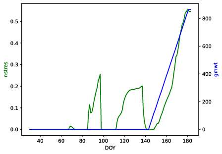
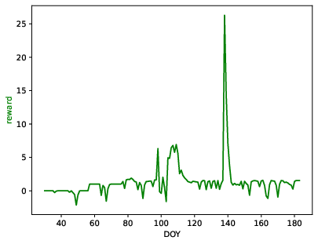
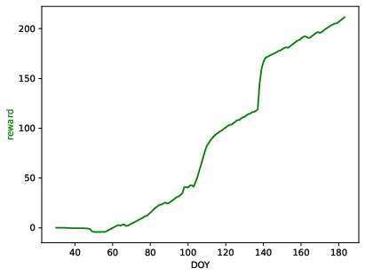

# gym-DSSAT: an easy to manipulate crop environment for Reinforcement Learning
gym-DSSAT is a modification of the [Decision Support System for Agrotechnology Transfer (DSSAT)](https://dssat.net/) software into an easy to manipulate [Open AI gym](https://gym.openai.com/) environment for Reinforcement Learning (RL) researchers in Python. gym-DSSAT allows daily based interactions during the growing season between an RL agent and the crop model with usual gym conventions.

gym-DSSAT is powered by the [PDI Data Interface (PDI)](https://pdi.julien-bigot.fr/master/) !

**Disclaimer: gym-DSSAT only supports Unix systems and uses Python 3.6 or above!**

## In this repository
+ ```./dssat-csm-os```: the submodule of modified the DSSAT Fortran code with PDI for gym-DSSAT
+ ```./gym-dssat-pdi```: the custom gym-DSSAT Python environment
+ ```./dssat-csm-data```: the required experimental files used by DSSAT
+ ```./gym_dssat_pdi_tests```: examples of how to run gym-DSSAT

## The environment
gym-DSSAT is designed to allow great setting flexibility. The environment comes with default settings that can easily been modified by editing the [gym environment's yaml configuration file](https://gitlab.inria.fr/rgautron/gym_dssat_pdi/-/blob/stable/gym-dssat-pdi/gym_dssat_pdi/envs/configs/env_config.yml). The ```action``` key gives the raw action space, the ```state``` key give the raw action space and each individual setting is found and can be edited in the ```setting``` key. Furthermore, the ```context``` key defines additional contextual variables.

gym-DSSAT uses by default the UFGA8201 maize experiment from the University of Florida, but is usable with any DSSAT experiment using the CERES-Maize module.

#### Action/State spaces

The environment comes with 3 modes:
+ nitrogen fertilization only (continuous quantity): ```mode=='fertilization'```
+ irrigation only (continuous quantity): ```mode=='irrigation'```
+ both nitrogen fertilization and irrigation (both continuous quantities): ```mode=='all'```

The action/state spaces depend on each mode and are detailed in [gym environment's yaml configuration file](https://gitlab.inria.fr/rgautron/gym_dssat_pdi/-/blob/stable/gym-dssat-pdi/gym_dssat_pdi/envs/configs/env_config.yml). State variables can be continuous, discrete and arrays of arbitrary shapes. Actions are continuous. By default, the observed state is given as a dictionnary as show below:

```python
{'cleach': 39.01179885864258,
'cnox': 0.07707925885915756,
'cumsumfert': 116.0,
'dap': 126,
'dtt': 20.900001525878906
...}
```

#### gym-DSSAT yaml configuration file structure
```yaml
action:
  anfer:
    type: float
    low: 0
    high: 200
    info: nitrogen to fertilize for current day (kg/ha)
...
state:
  cleach:
    type: float
    low: 0
    high: .inf
    info: cumulative nitrate leaching (kg/ha)

...
setting:
  all:
    action:
      - anfer
      - amir
    state:
      - yrdoy
...
```

#### Rewards
Reward functions are explicitely defined in a [separated file](https://gitlab.inria.fr/rgautron/gym_dssat_pdi/-/blob/stable/gym-dssat-pdi/gym_dssat_pdi/envs/utils/rewards.py) allowing easy custom reward function definitions. Default reward functions are designed to make challenging problems taking into account the costs of actions and the environmental factors.

## Usage
Make sure to well follow the [installation instructions](#installing-gym-dssat) before !
### Initialization
You can use gym-DSSAT as any gym environment. You need to pass gym-DSSAT configuration as following:

```python
import gym
env_args = {
    'run_dssat_location': '/opt/dssat_pdi/run_dssat',  # assuming (modified) DSSAT has been installed in /opt/dssat_pdi
    'log_saving_path': './logs/dssat-pdi.log',  # if you want to save DSSAT outputs for inspection
    # 'mode': 'irrigation',  # you can choose one of those 3 modes
    # 'mode': 'fertilization',
    'mode': 'all',
    'experiment_number': 3,
    'seed': 123456,
    'random_weather': True,  # if you want stochastic weather
}
env = gym.make('gym_dssat_pdi:GymDssatPdi-v0', **env_args)
```
That's all !
### Interacting with gym-DSSAT
Actions are provided to the environment in a dictionary:
```python
action_dict = {
    'amir': 10,  # if mode == irrigation or mode == all ; water to irrigate in L/ha
    'anfer': 5,  # if mode == fertilization or mode == all ; nitrogen to fertilize in kg/ha
}
observation, reward, done, info = env.step(action_dict=action_dict)  # info are contextual variables
```
The ```observation``` variable is a dictionnary. The current observation can be retrieved via ```env.observation``` or equivalently ```env.get_state()```:
```python
env.observation = 
{'cleach': 39.01179885864258,
'cnox': 0.07707925885915756,
'cumsumfert': 116.0,
'dap': 126,
'dtt': 20.900001525878906
...}
```
This dictionary can be concatenated to a list using ```env.observation_dict_to_array(env.observation)```. When crop is harvested, ```env.done``` is flagged ```True```.

An example of episode (for ```mode=='fertilization'```) is given by:
```python
while not env.done:
    observation = env.observation
    print(observation)
    # observation_list = env.observation_dict_to_array(observation)
    action = {'anfer': 1} # put 1 kg/ha of nitrogen
    observation, reward, done, info = env.step(action)
```
The ```info``` variable contains contextual informations. At any time, you can access the whole history for the ongoing episode with ```env.history```. Once crop is harvested, you need to reset the environment with ```env.reset()```. Else, you will not get any new state.

Once you're done, **terminate gym-DSSAT**:
```
env.close()
```

### Data visualization
gym-DSSAT provides a visualization interface both for raw state variables or rewards.
#### Trajectories
You can call:
```python
env.render(type='ts',  # time series mode
           feature_name_1='nstres',  # mandatory first raw state variable
           feature_name_2='grnwt')  # optional second raw state variable
```


#### Reward vizualization
For quick reward inspection, you can use:

```python
env.render(type='reward')  # plot reward time series (DOY for Day Of Year)
```



Or

```python
env.render(type='reward',
            cumsum=True)  # if you want cumulated rewards
```           


#### Getting information
You can get information about your current mode using:
```python
env.get_env_info()
```
This outputs:
```shell
******************
Available actions:
******************

{'anfer': {'high': 200,
           'info': 'nitrogen to fertilize for current day (kg/ha)',
           'low': 0,
           'type': 'float'}}
press "return" to continue
{'amir': {'high': 50,
          'info': 'water depth to irrigate for current day (mm/ha)',
          'low': 0,
          'type': 'float'}}
press "return" to continue

*********************
Observation variables:
*********************

{'cleach': {'high': inf,
            'info': 'cumulative nitrate leaching (kg/ha)',
            'low': 0,
            'type': 'float'}}
press "return" to continue
...
```

### More information
You can check [more examples](https://gitlab.inria.fr/rgautron/gym_dssat_pdi/-/blob/stable/gym_dssat_pdi_tests/run_env.py), including how to use gym-DSSAT in a multiprocessing context, using the ```env.reset_hard()``` feature.

## Installing gym-DSSAT
Here you will find how to install in the order the various components of gym-DSSAT.

### 0. Dependencies
#### i. CMake
You can find instructions [here](https://cmake.org/install/)
```shell
wget https://github.com/Kitware/CMake/releases/download/v3.21.3/cmake-3.21.3.tar.gz
gunzip -c cmake-3.21.3.tar.gz | tar xf -
cd cmake-3.21.3
./bootstrap
make
sudo make install
```
#### ii. OpenMPI
You can check installation instruction (here)[https://www.open-mpi.org/faq/?category=building#easy-build]
```shell
wget https://download.open-mpi.org/release/open-mpi/v4.1/openmpi-4.1.1.tar.bz2
tar -xjf openmpi-4.1.1.tar.bz2
cd openmpi-4.1.1
./configure --prefix=/opt/openmpi-4.1.1
<...lots of output...>
sudo make all install
```
#### iii. gfortran
To install [gfortran](https://gcc.gnu.org/wiki/GFortran), you can use ```sudo apt-get install gfortran```

#### iv. Python
To install [Python](https://www.python.org/) (>=3.6), you can use ```sudo apt install python3.9```. The following Python package are requires:
+ matplotlib: ```pip install matplotlib```
+ numpy: ```pip install numpy```
+ jinja2: ```pip install Jinja2```
+ gym: ```pip install gym```

### 1. PDI Data Interface (PDI)
In order to install the [PDI](https://pdi.julien-bigot.fr/master/), you can check the [official instruction](https://pdi.julien-bigot.fr/master/Installation.html) but **be careful to correctly set cmake flags as shown below**

Recommended installation directories are ```/opt/pdi``` or ```${HOME}/.pdi``` ; if possible avoid ```/usr/local/```. In the following we assume you installed PDI in ```/opt/pdi```.

```shell
wget https://gitlab.maisondelasimulation.fr/pdidev/pdi/-/archive/1.3.1/pdi-1.3.1.tar.bz2
tar -xjf pdi-1.3.1.tar.bz2
mkdir pdi-1.3.1.tar.bz2/build
cd pdi-1.3.1.tar.bz2/build
cmake -DCMAKE_INSTALL_PREFIX='/opt/pdi' -DBUILD_HDF5_PARALLEL=OFF -DBUILD_PYTHON=ON -DBUILD_PYCALL_PLUGIN=ON ..  # configuration
sudo make install   # compilation and installation
```
### 2. (modified) DSSAT
From the root of this repository, supposing PDI has been installed in ```/opt/pdi``` and (modified) DSSAT to be installed in ```/opt/dssat_pdi```:
```shell
cd dssat-csm-os
mkdir build
cmake -DCMAKE_INSTALL_PREFIX='/opt/dssat_pdi' -DCMAKE_PREFIX_PATH='/opt/pdi/share/paraconf/cmake;/opt/pdi/share/pdi/cmake' ..
make
sudo make install
```
*Note: if for some reason DSSAT compilation failed, please empty the folder ```dssat-csm-os/build``` before retrying to compile DSSAT*

After then, you will need to provide DSSAT the required experimental files. From the root of this repository, assuming DSSAT has been installed in ```/opt/dssat_pdi```:
```shell
cd dssat-csm-data
sudo cp -r dssat-csm-data/* /opt/dssat_pdi
```

### 3. (finally) gym-DSSAT
From the root of this repository:
```shell
cd gym-dssat-pdi
pip install -e .
```