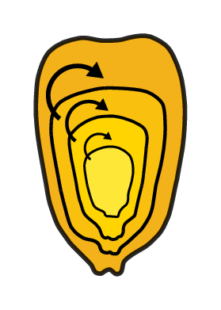

# gym-dssat: an easy to manipulate crop environment for Reinforcement Learning



## What is gym-dssat?
```gym-dssat``` is a modification of the [Decision Support System for Agrotechnology Transfer (DSSAT)](https://dssat.net/) Fortran software into an easy to manipulate Python [Open AI gym](https://gym.openai.com/) environment for Reinforcement Learning (RL) researchers. ```gym-DSSAT``` allows daily based interactions during the growing season between an RL agent and the crop model with usual gym conventions.

**Important: At the moment gym-DSSAT only supports common Linux distributions**

## Getting started
| Link | Content |
|-|-|
| <a href="https://rgautron.gitlabpages.inria.fr/gym-dssat-docs/Installation/index.html"></a> | Installation with package (recommended), using [Docker](https://www.docker.com/) or from source. |
| <a href="https://rgautron.gitlabpages.inria.fr/gym-dssat-docs/"></a> | Get a tour of gym-dssat, including advanced usage. |
| <a href="https://rgautron.gitlabpages.inria.fr/gym-dssat-docs/Tutorials/index.html"></a> | Learn to use by practice in Google Colab (to come soon) |
| <a href="https://hal.inria.fr/hal-03711132/"></a> | More information about how gym-DSSAT works, and provides use cases |

## How is gym-dssat tested?

Before deploying any new version, **gym-dssat** is built from scratch in a custom Docker image, and the environment tested in a container using [Gitlab CI/CD](https://docs.gitlab.com/ee/ci/), for all supported platforms. If you experience any problem, please create [an issue](https://gitlab.inria.fr/rgautron/gym_dssat_pdi/issues/new?title=Issue%20on%20page%20%2Findex.html&body=Your%20issue%20content%20here).

## Help & support

Tha main support channel for gym-dssat is our mailing list:
https://sympa.inria.fr/sympa/info/gym-dssat

You can send there any issue/request related to gym-dssat and we will
try to manage it as soon as possible. The list archive can be
consulted without being subscribed to it:
https://sympa.inria.fr/sympa/arc/gym-dssat

Additionaly, you can get interactive support or just talk about
gym-dssat in this IRC channel:

    #gym-dssat in OFTC

You can use your favorite IRC client (use irc.oftc.net as server's
address. SSL is optional) or a web client like the one OFTC provides:
https://webchat.oftc.net

## Repository content
+ ```./dssat-csm-os```: the submodule of ```dssat-pdi```:  modified the DSSAT Fortran code with PDI for ```gym-DSSAT```
+ ```./gym-dssat-pdi```: the custom ```gym-DSSAT``` Python environment with a use example in ```./gym-dssat-pdi/gym_dssat_pdi_samples```
+ ```./dssat-csm-data```: submodules of the required experimental files used by DSSAT
+ ```./deb_pking```: Linux installation packages
+ ```./docker_recipes```: Dockerfiles for ```gym-dssat```.

## Citing gym-DSSAT

If you use `gym-DSSAT` in your publications, please cite us following this Bibtex entry:

```bibtex
@phdthesis{gautron2022gym,
title={gym-DSSAT: a crop model turned into a Reinforcement Learning environment},
author={Gautron, Romain and Gonzalez, Emilio Jos{\'e} Padron and Preux, Philippe and Bigot, Julien and Maillard, Odalric-Ambrym and Emukpere, David},
year={2022},
school={Inria Lille}
    }
```

## About this project

```gym-DSSAT``` is powered by the [PDI Data Interface (PDI)](https://pdi.julien-bigot.fr/master/) !

#### Contributing
Any [new issue](https://gitlab.inria.fr/rgautron/gym_dssat_pdi/issues/new?title=Issue%20on%20page%20%2Findex.html&body=Your%20issue%20content%20here) is welcomed! If you want to actively contribute, you can check issues the **wishlist** tag.

#### Authors
Romain Gautron and Emilio Padrón González

**Principal contact**:

- first name: romain
- last name: gautron 
- institute: cirad
- country: france

```text
f_n dot l_n at institute dot two_first_letters_of_country
```

#### Acknowledgements
We acknowledge the DSSAT team, especially Gerrit Hoogenboom and Cheryl Porter. Thanks to the PDI team, especially to Julien Bigot. We acknowledge Bruno Raffin, leader of Inria’s DataMove team, for his support. We acknowledge the Consultative Group for International Agricultural Research’s (CGIAR) Platform for Big Data in Agriculture, special thanks to Brian King. Thanks to the French Agricultural Research Centre for International Development (CIRAD) and the French Institute for Research in Computer Science and Automation (Inria), in particular the SCOOL team, for their support.